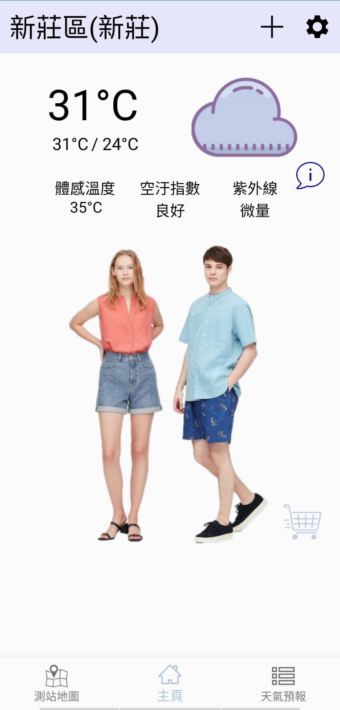
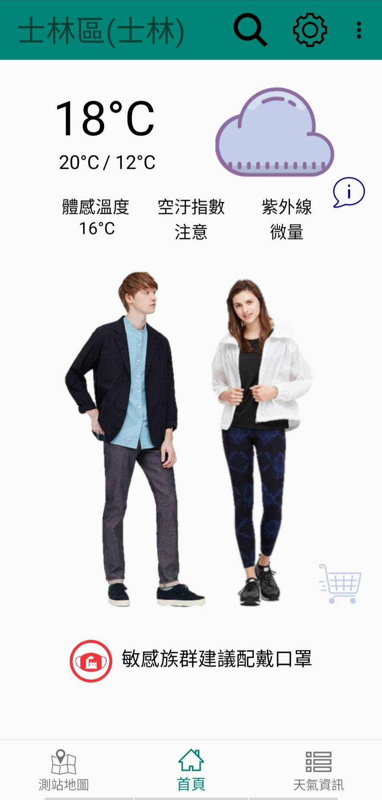
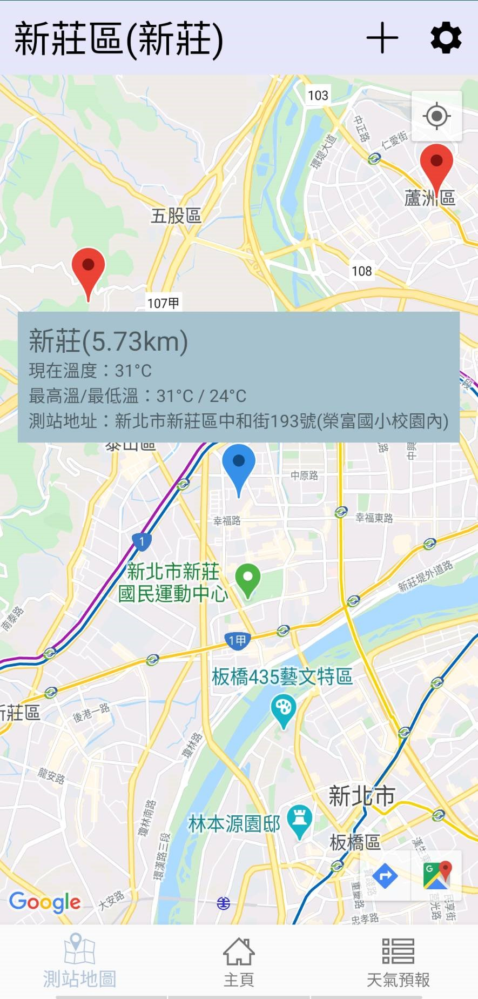
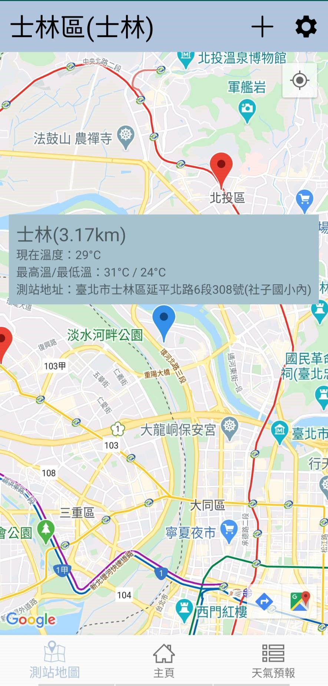
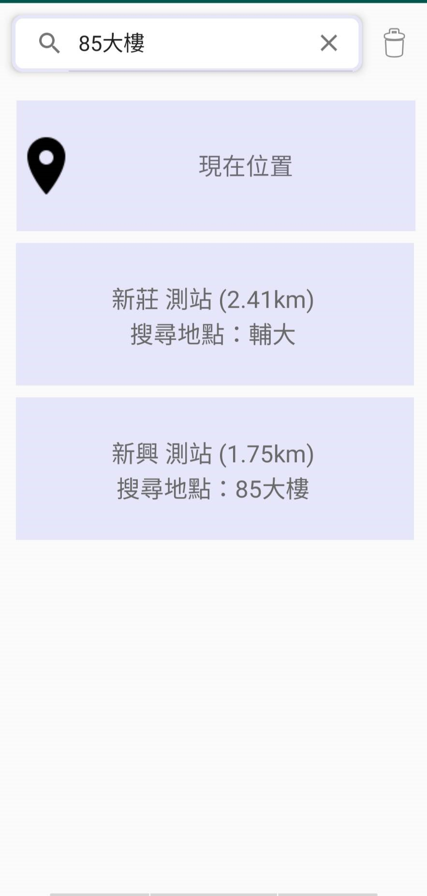
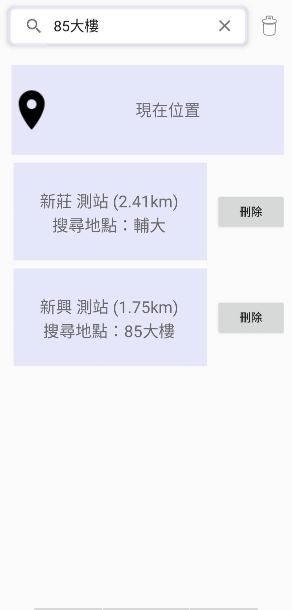
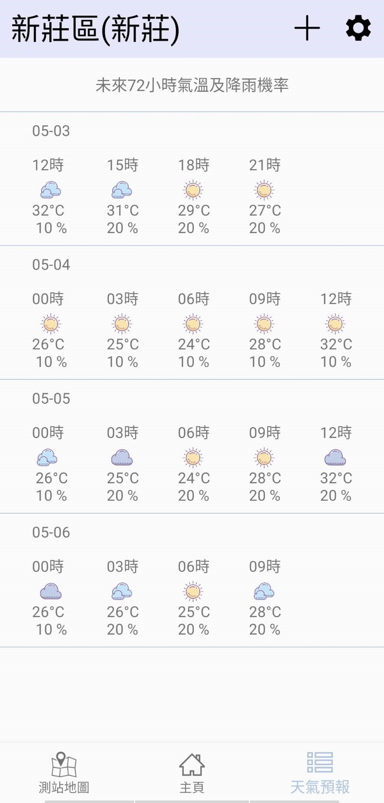
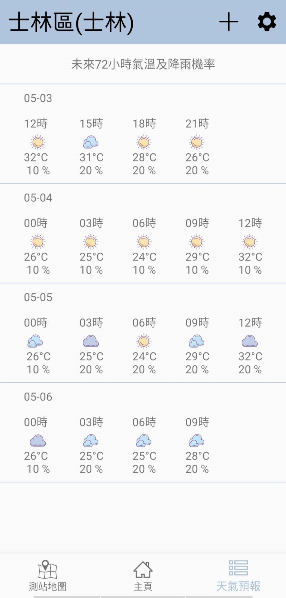
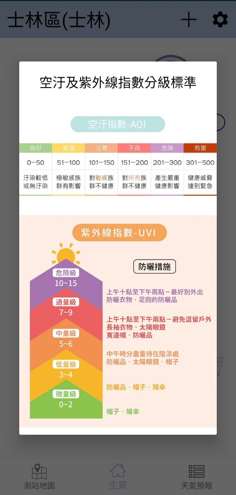

# Weather & Wearing 天氣穿搭應用

「Weather & Wearing」是針對天氣所開發的系統，目前市面上如果使用者想要查詢天氣資訊、空氣汙染資訊或是衣服穿搭都要下載不同的app才能享有這些功能，因此整合所有跟天氣有關的資訊以及根據天氣資訊
提供相應的衣服穿搭推薦。且多數的天氣應用程式是以區域進行分類，這樣的分類方式對於處在區域邊緣的使用者可能不夠精確，因此我們將以最近測站作為判斷標準，提供使用者更好、更便利且更精確的服務。
此外，一般使用者使用天氣系統的目的之一是為了外出的穿著做參考，於是本系統將加入穿著建議，使用者可以看到系統根據相關資料所建議的穿著搭配，以增加本系統的實用性。希望降低使用者的閱讀門檻，將常用資訊
以便於理解的方式呈現，而非僅以數字呈現，改成以文字描述或是圖片等方式代替。

此專案為Android應用程式，使用Java開發，並串接中央氣象局API、環保署API、Google Map API等，取得天氣、空汙、指標等多項資訊。

## 功能

本系統的功能可分為五大項，分別是：即時天氣瀏覽、未來天氣預報、測站地圖、搜尋新增測站與設定。

1. 即時天氣：多數應用程式顯示過多較少使用且較專業的資訊，內容較為繁雜而難以理解，故本系統將簡化頁面，只顯示現在氣溫、最高最低溫、紫外線強度及空汙指數等較常用的資訊也提供當前天氣的推薦穿著，
方便使用者能夠輕易的瀏覽。同時加入小提醒，提醒是否該帶雨傘、需不需要注意防曬或者是否該戴口罩。

2. 天氣預報：中央氣象局的網站提供近72小時每三小時的溫度、每六小時的降雨機率等天氣預報，根據最保守原則，有溫度而無降雨機率資料之部分，由前後三個小時的降雨機率之最大者填充之。故本系統於天氣預報
的頁面，提供近72小時每三小時的溫度及降雨機率。

3. 測站地圖：將全台每個天氣測站及使用者目前定位或使用者指定位置(新增的測站)標示於地圖上，並用不同顏色標出最近測站讓使用者可以明確地看出最近之測站的資訊。若使用者想看到其他測站之天氣資訊，亦
可以點選各個測站，查看簡易的天氣資訊。

4. 搜尋及新增地點：搜尋方面，使用者能透過搜尋找到想要新增的地點。新增方面，在新增成功後，點選已新增的地點就能隨時切換不同地點的天氣，以利使用者查看新增各個地點的即時天氣、天氣預報及測站地圖。

5. 設定：可以開啟或關閉通知。

## 介面

首頁 (根據設定之測站位置提供穿搭服務)

&nbsp;&nbsp;

測站地圖頁面 (顯示設定的測站位置、資訊以及周遭地圖)

&nbsp;&nbsp;

測站管理頁面 (透過地址、座標或取得現在位置搜尋測站)

&nbsp;&nbsp;

天氣資訊頁面 (根據設定之測站位置顯示即時天氣、最高溫最低溫、天氣預報等資訊)

&nbsp;&nbsp;

溫度舒適度指標頁面 

